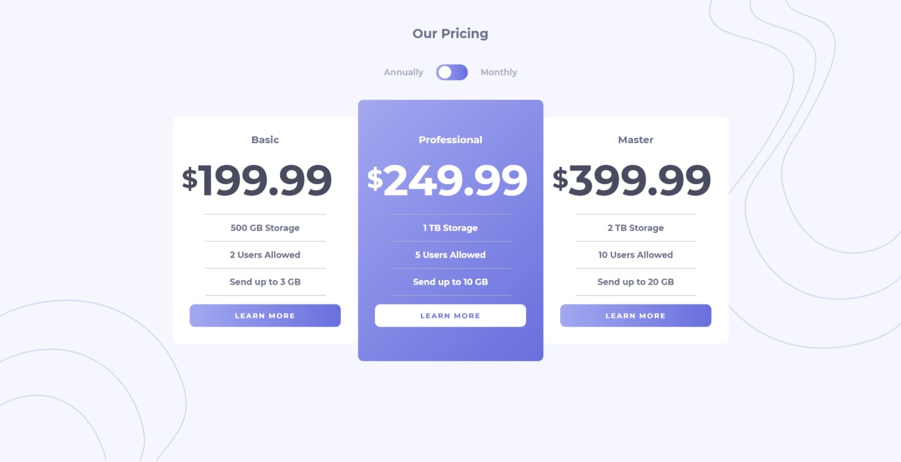

# Frontend Mentor - Pricing component with toggle solution

This is a solution to the [Pricing component with toggle challenge on Frontend Mentor](https://www.frontendmentor.io/challenges/pricing-component-with-toggle-8vPwRMIC). Frontend Mentor challenges help you improve your coding skills by building realistic projects.

## Table of contents

- [Overview](#overview)
  - [The challenge](#the-challenge)
  - [Screenshot](#screenshot)
  - [Links](#links)
- [My process](#my-process)
  - [Built with](#built-with)
  - [What I learned](#what-i-learned)
- [Author](#author)

**Note: Delete this note and update the table of contents based on what sections you keep.**

## Overview

### The challenge

Users should be able to:

- View the optimal layout for the component depending on their device's screen size
- Control the toggle with both their mouse/trackpad and their keyboard

### Screenshot

#### Mobile Design

#### Desktop Design

### Links

- Solution URL: [Frontend Mentor Solution](https://www.frontendmentor.io/solutions/responsive-pricing-component-using-sass-bem-and-javascript-nFFE86G_q)
- Live Site URL: [URL](https://silly-tereshkova-7ea5d0.netlify.app/)

## My process

### Built with

- Base HTML5 markup
- Sass
- Flexbox
- Mobile-first workflow
- JavaScript

### What I learned

- I learned that make background "bg-bottom" stay at the bottom of page instead of of the bottom of viewport

## Author

- Website - [Tin.Pham](https://github.com/tin-pham)
- Frontend Mentor - [@phambaohuy12345](https://www.frontendmentor.io/profile/phambaohuy12345)
- Facebook - [Tin Pham](https://www.facebook.com/joseph.webdev)

**Note: Delete this note and add/remove/edit lines above based on what links you'd like to share.**
